# Windows Server Active Directory Lab

This lab involves the configuration, administration, and deployment of an enterprise Windows Server environment using the Active Directory Domain Services (AD DS). The lab includes the creation of organizational units, users, groups, assignment of users to their respective groups, creation of shared folders, and configuration of permissions using a Microsoft Windows Server 2019 virtual machine.

## Objective
- Learn and understand the processes involved in Windows administration

- Deploy an Active Directory environment

- Manage enterprise users and groups

- Create shared folders and configure permissions on the shared folders

## Lab Environment
In this lab, I used a Microsoft Windows Server 2019 virtual machine hosted on VMware Workstation.

## Active Directory Deployment

I installed Active Directory Domain Services through Server Manager by navigating to
**Manage > Add Roles and Features** and selecting the Active Directory Domain Services role. 
I added the required features, and the installation was completed successfully. I promoted the server to a domain controller by configuring a new Active Directory forest with the domain name **training.global**. During the setup process, DNS services and the NetBIOS name were configured automatically, while a Directory Services Restore Mode (DSRM) password was created.

## Organizational Units 

I created Organizational Units to categorize users and groups into their respective departments for easier administration and management. 
I created the following departments:
- IT Department
- HR Department
- Finance Department

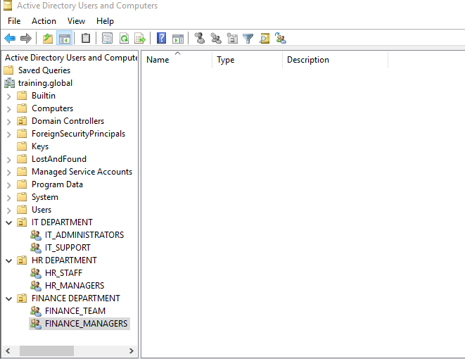

*Figure 1: Creation of Organizational Units*

Each of these departments consisted of their own groups and users. 

## User and Group Creation

I created 8 users in the Active Directory for the various departments in the organization. This was done by right-clicking on the 'create user' icon on the top part of the Active Directory Users and Computers (ADUC), and then creating a new user. 
The following groups were created for each department: 
### IT DEPARTMENT 
- IT_ADMINISTRATORS 
- IT_SUPPORT
   
### HR DEPARTMENT 
- HR_STAFF 
- HR_MANAGERS
  
### FINANCE DEPARTMENT
- FINANCE_TEAM 
- FINANCE_MANAGERS 

The groups were created using the Active Directory Users and Computers (ADUC) by right-clicking on the 'create group' icon on the top part of the ADUC, and then creating a new group. Users were assigned to their respective groups by accessing the user's properties, navigating to the **Member Of** tab, and adding the required group memberships.

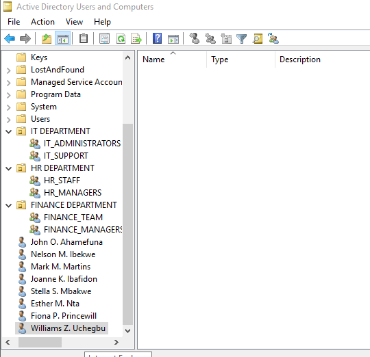

*Figure 2.1: Users Created.*

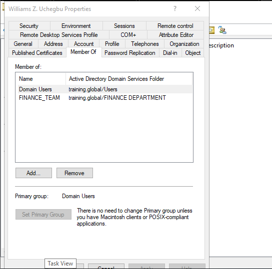

*Figure 2.2: User added to a group.*

## Shared Folder Configuration

I created a shared folder called **SOFTWARE_APPLICATIONS** on the desktop environment of the Windows Server virtual machine. 
The folder was configured through the sharing settings by navigating to **Properties > Sharing > Advanced Sharing** and enabling the folder sharing option.

The folder was configured to be accessible to all departments in the organization. Read permissions were assigned to users to allow access to the shared applications, while the **IT_ADMINISTRATORS** group was given full permissions for administrative purposes.

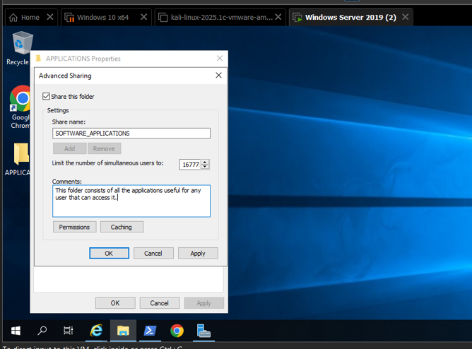

*Figure 3.1: Configuration of the SOFTWARE_APPLICATIONS shared folder.*

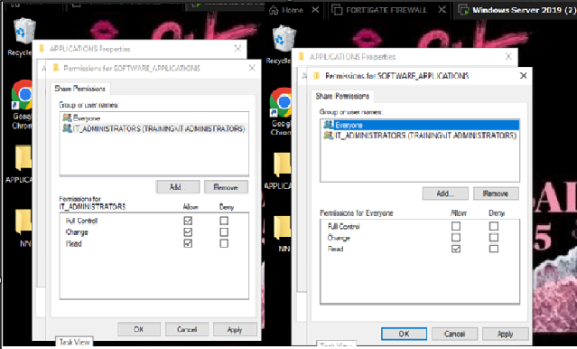

*Figure 3.2: Permission settings for the SOFTWARE_APPLICATIONS shared folder.*

## Group Policy Configuration

I configured Group Policy Objects (GPOs) to centrally manage software deployment, desktop customization, and security policies across user systems in the domain environment.

### Wireshark Software Deployment

I downloaded the **.msi** version of Wireshark and saved it in the shared folder called **SOFTWARE_APPLICATIONS** so it could be accessible to other user computers on the domain.

Using **Server Manager > Tools > Group Policy Management**, I configured a software installation policy through:

**Computer Configuration > Policies > Software Settings > Software Installation**

I added the network path to the Wireshark application from the shared folder and assigned the application so it could be automatically installed on user computers. After configuration, I enforced the policy and performed a forced Group Policy update through the terminal to ensure successful deployment.

### Wireshark Deployment Configuration

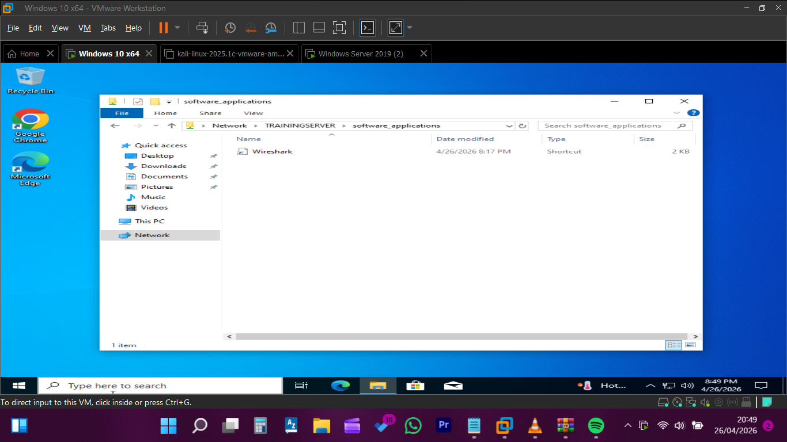

*Figure 4.1: Wireshark installation package prepared for deployment.*

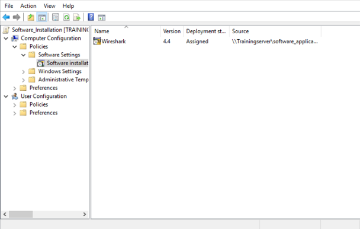

*Figure 4.2: Configuring Wireshark deployment using the assigned deployment method.*

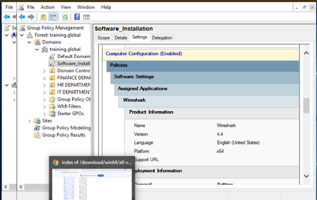

*Figure 4.3: Wireshark successfully assigned through Group Policy.*

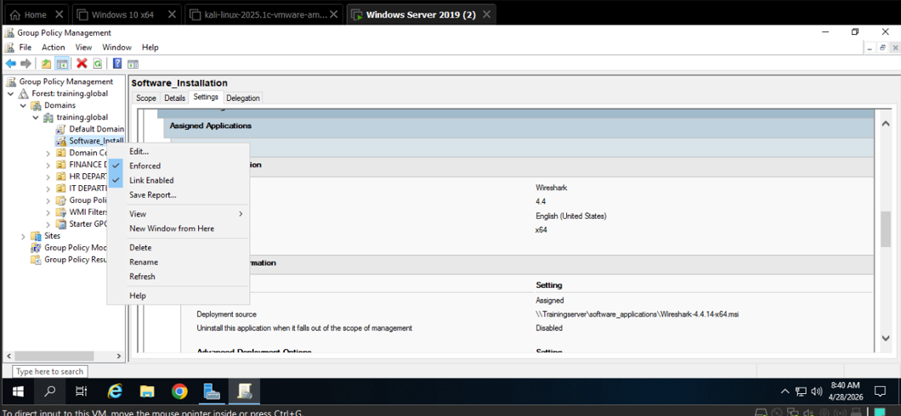

*Figure 4.4: Enforcement of the Wireshark deployment policy.*

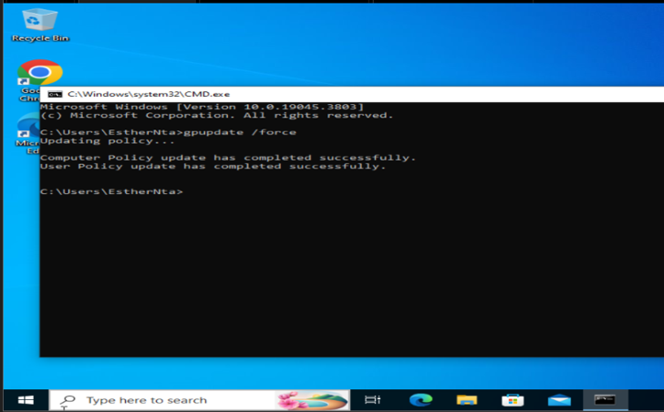

*Figure 4.5: Forced Group Policy update to apply deployed configurations.*

### Wallpaper Policy Configuration

I configured a wallpaper policy to centrally enforce a uniform desktop background across user computers in the domain environment. This was done through Group Policy by configuring the desktop wallpaper settings and enforcing the background policy for domain users.

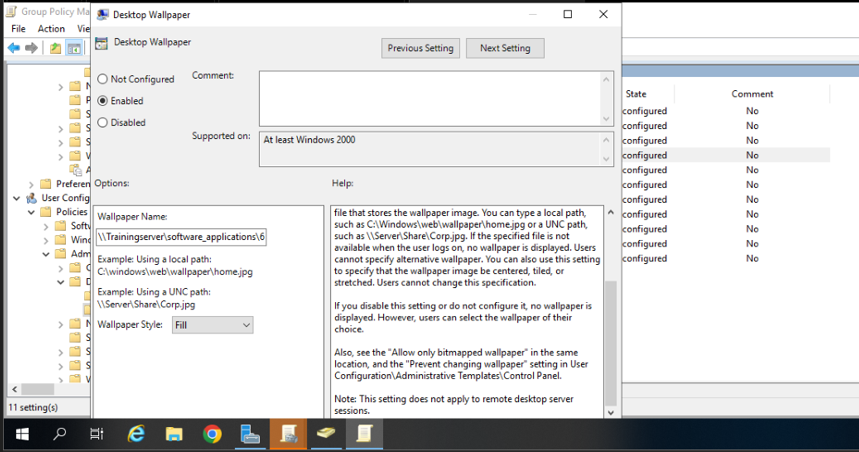

*Figure 5.1: Enabling wallpaper policy through Group Policy.*

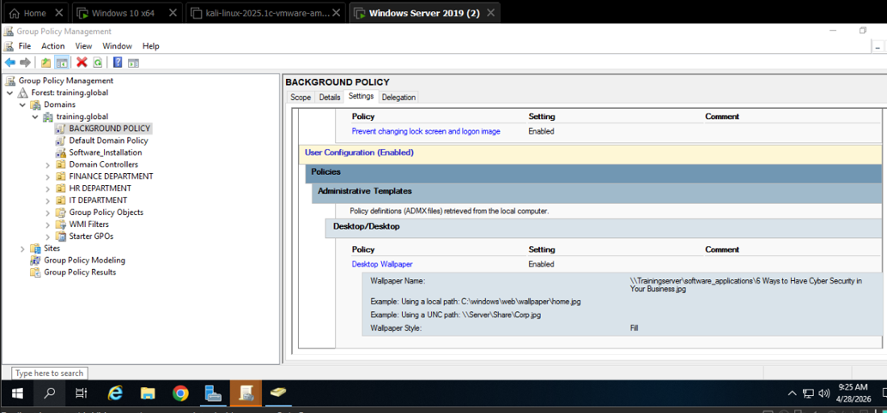

*Figure 5.2: Enforcement of a centralized desktop wallpaper policy.*

### Password Policy Configuration

I configured a password policy through Group Policy Management to strengthen user account security within the domain environment, and directly applied it to the **FINANCE_MANAGERS** and **IT_ADMINISTRATORS** groups. 

This was done through:

**Computer Configuration > Policies > Windows Settings > Security Settings > Account Policies > Password Policy**

The policy was configured to enforce password-related security settings for the targeted administrative and management groups..

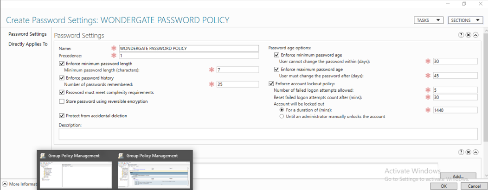

*Figure 6.1: Creating and configuring password policies through Group Policy.*

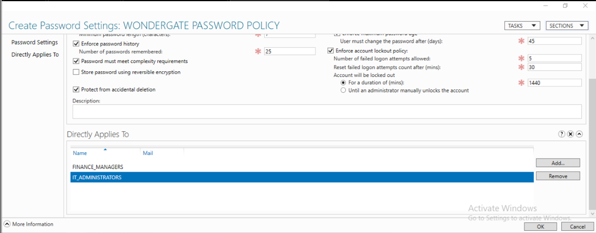

*Figure 6.2: Direct application of Group Policy to domain groups.*

## Skills Demonstrated

Through this lab, I demonstrated the following technical skills:

- Active Directory Administration
  
- Windows Server 2019 Administration
  
- Active Directory User and Group Management
  
- Organizational Unit (OU) Management
  
- Access Control and Permission Management
  
- Group Policy Object (GPO) Configuration
  
- Software Deployment via Group Policy
  
- Password Policy Enforcement
  
- VMware Workstation Virtualization
